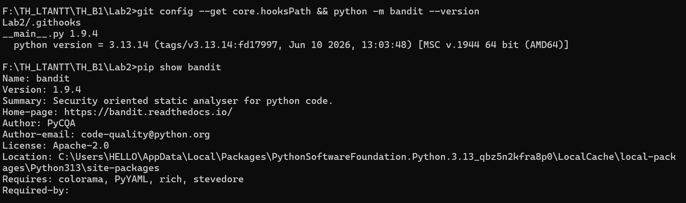
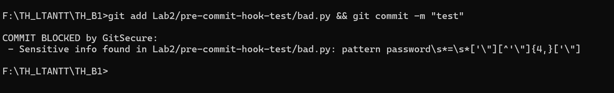
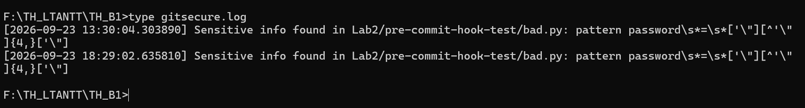
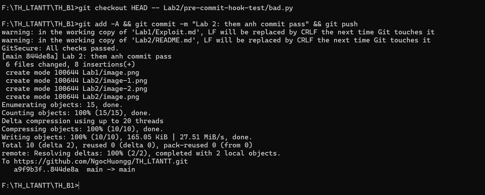

# Lab 2 – Bảo mật với pre-commit hook (GitSecure)

Thực hành: Bảo mật với pre-commit hooks

Họ và tên: Đoàn Xuân Hướng

Lớp: 23DATA1

MSSV: 2387700025

---

## 1. Mục tiêu

Viết một pre-commit hook để Git **tự động chặn commit** khi phát hiện vấn đề bảo mật trong các file
sắp được commit, đồng thời ghi lại chi tiết các phát hiện (findings) vào file `gitsecure.log` để xem
xét và xử lý sau.

## 2. Hook làm gì

Mỗi lần `git commit`, Git chạy `Lab2/.githooks/pre-commit` (script Python) từ thư mục gốc của repo:



1. Lấy danh sách file đã stage bằng `git diff --cached --name-only`.
2. Với từng file, chạy hai kiểm tra:

   | Kiểm tra | Cách làm | Thông báo khi vi phạm |
   |---|---|---|
   | Thông tin nhạy cảm viết cứng trong code | So khớp các regex trong `SENSITIVE_PATTERNS`: API key, secret, password, token, AWS access key (`AKIA`/`ASIA` + 16 ký tự) | `Sensitive info found in <file>: pattern <regex>` |
   | Quyền file quá thoáng | `os.stat()` – file cho phép mọi người ghi (`S_IWOTH`) | `File <file> is world-writable!` |

3. Chạy Bandit quét toàn bộ repo (`bandit -r .`) để tìm lỗi mức High.
4. Có finding thì in `COMMIT BLOCKED by GitSecure:` kèm danh sách, ghi từng dòng vào `gitsecure.log`
   và thoát với mã 1 để Git huỷ commit. Không có finding thì in `GitSecure: All checks passed.`

## 3. Cấu trúc

```
TH_B1/
├── .gitignorelog và __pycache__
└── Lab2/
    ├── .githooks/
    │   └── pre-commit            
    ├── pre-commit-hook-test/
    │   └── bad.py                
    ├── requirements.txt          
    └── README.md
```

`gitsecure.log` được tạo ở thư mục gốc `TH_B1/` vì Git luôn chạy hook từ đó; file này đã nằm trong
`.gitignore` nên không bị commit.

## 4. Cài đặt

Chạy tại thư mục gốc `TH_B1`:

```bash
pip install -r Lab2/requirements.txt
git config core.hooksPath Lab2/.githooks
```

- Trong sách hook nằm ở gốc repo nên dùng `core.hooksPath .githooks`; ở repo này hook nằm trong
  `Lab2/` nên đường dẫn là `Lab2/.githooks`.
- Trên Windows không cần `chmod +x`: Git for Windows tự coi file bắt đầu bằng `#!` là file thực thi.
  Trên Linux/macOS thì chạy `chmod +x Lab2/.githooks/pre-commit`.
- Sau khi bật, hook áp dụng cho **mọi commit** trong repo (cả Lab1, Lab3). Nếu chưa cài bandit, mọi
  commit đều bị chặn với thông báo `Bandit not installed. Run: pip install bandit`.

## 5. Kiểm tra hook

**Bước 1 – commit file có thông tin nhạy cảm.** `pre-commit-hook-test/bad.py` gán cho biến
`password` chuỗi `123456`.

```bash
git add Lab2/pre-commit-hook-test/bad.py
git commit -m "test"
```

Commit bị chặn:



```
COMMIT BLOCKED by GitSecure:
 - Sensitive info found in Lab2/pre-commit-hook-test/bad.py: pattern password\s*=\s*['\"][^'\"]{4,}['\"]
```

Finding được ghi vào `gitsecure.log`:



```
[2026-09-23 13:03:16.126263] Sensitive info found in Lab2/pre-commit-hook-test/bad.py: pattern password\s*=\s*['\"][^'\"]{4,}['\"]
```

**Bước 2 – xoá thông tin nhạy cảm rồi commit lại.** Sửa `bad.py` để mật khẩu không còn nằm trong
code, ví dụ đọc từ biến môi trường:



```python
import os

password = os.environ.get("APP_PASSWORD")
```

```bash
git add .
git commit -m "[add] githooks"
git push
```

Kết quả: `GitSecure: All checks passed.` và commit được tạo.

