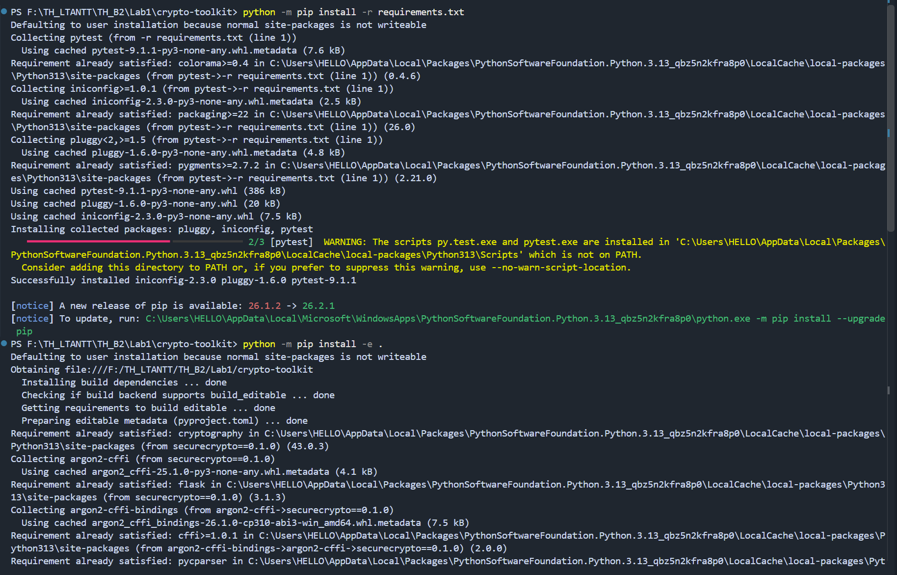
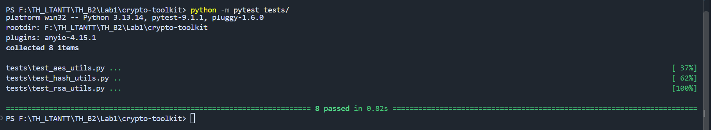
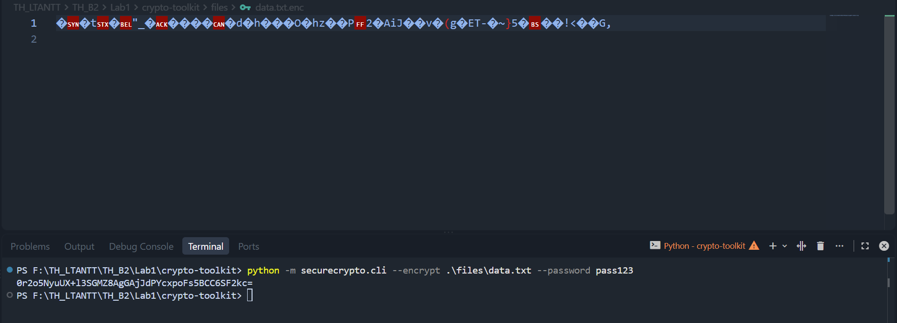
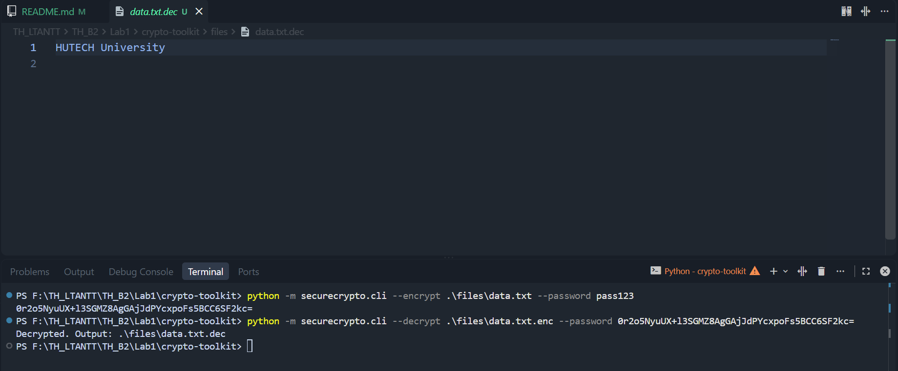
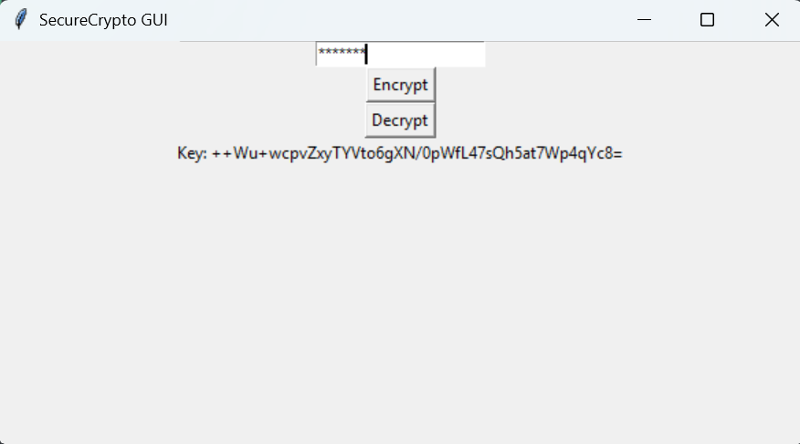
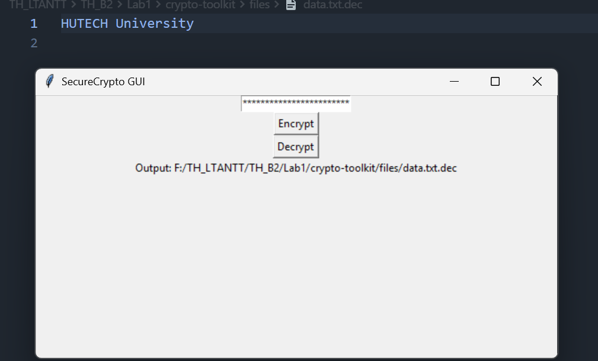
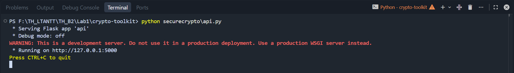
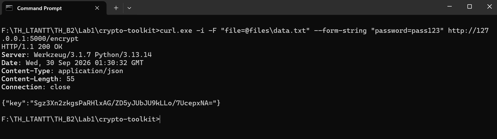
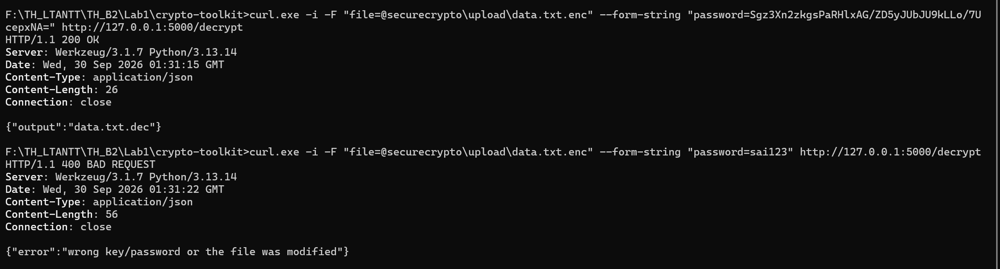

# Lab 1 – Thư viện mật mã (CryptoToolkit)

Thực hành: Xây dựng thư viện mật mã `securecrypto` (mục 2.2)

Họ và tên: Đoàn Xuân Hướng

Lớp: 23DATA1

MSSV: 2387700025

---

## 1. Mục tiêu

Xây dựng thư viện mật mã `securecrypto` và dùng nó qua 3 giao diện: dòng lệnh (CLI), cửa sổ Tkinter
(GUI) và REST API (Flask).

| Yêu cầu (2.2.1) | Thực hiện |
|---|---|
| `encrypt_file_aes(filepath, password)` – mã hoá file bằng AES-256-GCM | `aes_utils.py`: PBKDF2-HMAC-SHA256 (100 000 vòng, salt 16 byte) dẫn xuất khoá 32 byte, AES-GCM với nonce 12 byte. File `.enc` = `salt ‖ nonce ‖ ciphertext+tag`. Trả về khoá (Key) dạng base64 |
| `decrypt_file_aes(encrypted_file, password)` – giải mã file | `aes_utils.py`: nhận **Key base64** (như sách) **hoặc password** (như yêu cầu), ghi ra `<tên>.dec` |
| `generate_rsa_keypair(key_size)` – tạo cặp khoá RSA | `rsa_utils.py`: RSA 2048 bit, e = 65537 |
| `sign_data_rsa(data, private_key)` – ký số | `rsa_utils.py`: RSA PKCS#1 v1.5 + SHA-256 |
| `verify_signature_rsa(data, signature, public_key)` – xác thực chữ ký | `rsa_utils.py`: trả `True`/`False` |
| `hash_password_secure(password)` – băm mật khẩu | `hash_utils.py`: Argon2 (`argon2-cffi`) |

## 2. Cấu trúc

```
Lab1/
├── README.md
└── crypto-toolkit/
    ├── files/
    │   └── data.txt              "HUTECH University" – file để thử mã hoá
    ├── securecrypto/
    │   ├── __init__.py
    │   ├── aes_utils.py
    │   ├── api.py                Flask API: POST /encrypt, POST /decrypt
    │   ├── app_gui.py            giao diện Tkinter
    │   ├── cli.py                lệnh securecrypto-cli
    │   ├── hash_utils.py
    │   └── rsa_utils.py
    ├── tests/
    │   ├── test_aes_utils.py
    │   ├── test_hash_utils.py
    │   └── test_rsa_utils.py
    ├── requirements.txt
    └── setup.py
```

## 3. Cài đặt và chạy unit test

```bash
cd TH_B2/Lab1/crypto-toolkit
python -m pip install -r requirements.txt
python -m pip install -e .
python -m pytest tests/
```



`pip install -e .` cài gói `securecrypto` (kèm `cryptography`, `argon2-cffi`, `flask`) ở chế độ
editable và tạo lệnh `securecrypto-cli`. Kết quả test:

```
tests\test_aes_utils.py ...
tests\test_hash_utils.py ..
tests\test_rsa_utils.py ...
============================== 8 passed ==============================
```



Sách có 6 test; thêm 2 test cho `test_aes_utils.py`: giải mã bằng password và giải mã sai
Key/password phải báo lỗi `InvalidTag`.

## 4. CLI

```bash
securecrypto-cli --encrypt .\files\data.txt --password pass123
securecrypto-cli --decrypt .\files\data.txt.enc --password <Key vừa in ra>
```

```
AdxCr5GoKCcFUy+mRn/rLWFqN5J2MZP4GefaLT6fVmw=
Decrypted. Output: .\files\data.txt.dec
```

`files/data.txt.dec` chứa lại `HUTECH University`. Lệnh giải mã cũng nhận thẳng `--password pass123`.
Sai Key/password thì in `Decryption failed: wrong key/password or the file was modified.` và thoát mã 1.






Nếu báo `securecrypto-cli is not recognized` (Python cài từ Microsoft Store không đưa thư mục
`Scripts` vào PATH) thì chạy `python -m securecrypto.cli --encrypt ...` thay thế.

## 5. GUI

```bash
python securecrypto/app_gui.py
```

1. Nhập mật khẩu → **Encrypt** → chọn file. Cửa sổ hiện `Key: ...`, Key đồng thời được copy vào
   clipboard.


2. Dán Key (hoặc nhập lại mật khẩu) vào ô → **Decrypt** → chọn file `.enc`. Cửa sổ hiện
   `Output: <đường dẫn file .dec>`.


## 6. Flask API

```bash
python securecrypto/api.py
```

API chạy tại `http://127.0.0.1:5000`. Kiểm tra bằng Postman, Body → **form-data**:



| Request | `file` (File) | `password` (Text) | Response |
|---|---|---|---|
| `POST /encrypt` | `data.txt` | `pass123` | `{"key": "<Key base64>"}` |
| `POST /decrypt` | `data.txt.enc` | Key ở trên (hoặc `pass123`) | `{"output": "data.txt.dec"}` |

File upload và kết quả nằm trong `securecrypto/upload/` (thư mục này có trong `.gitignore`). Thiếu
`file`/`password` hoặc sai Key thì API trả `400 {"error": "..."}`.





