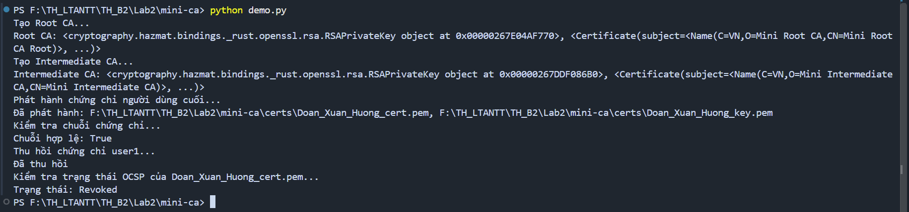
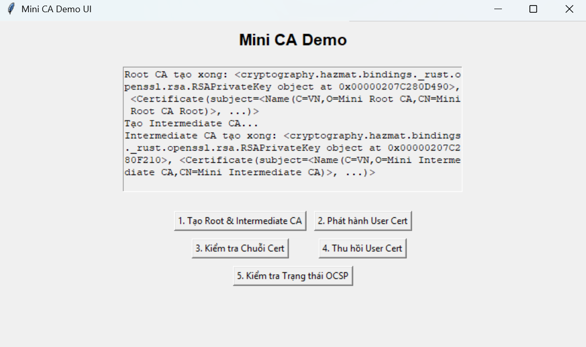
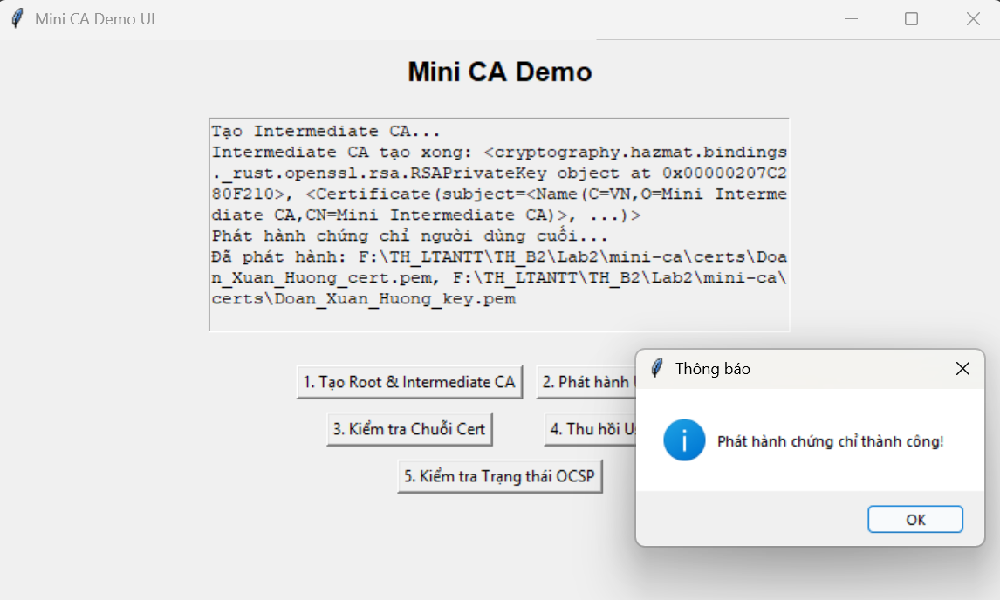
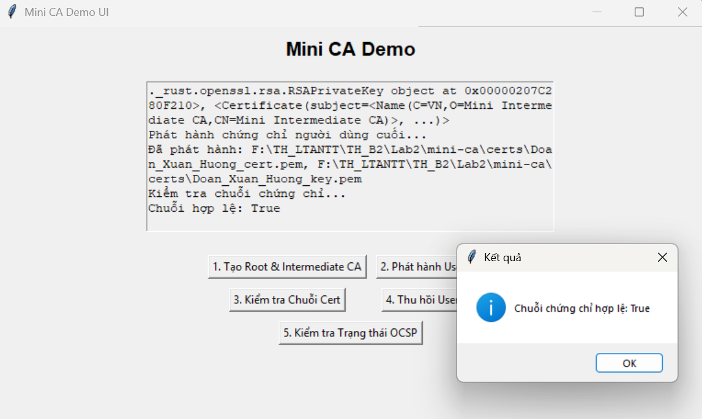
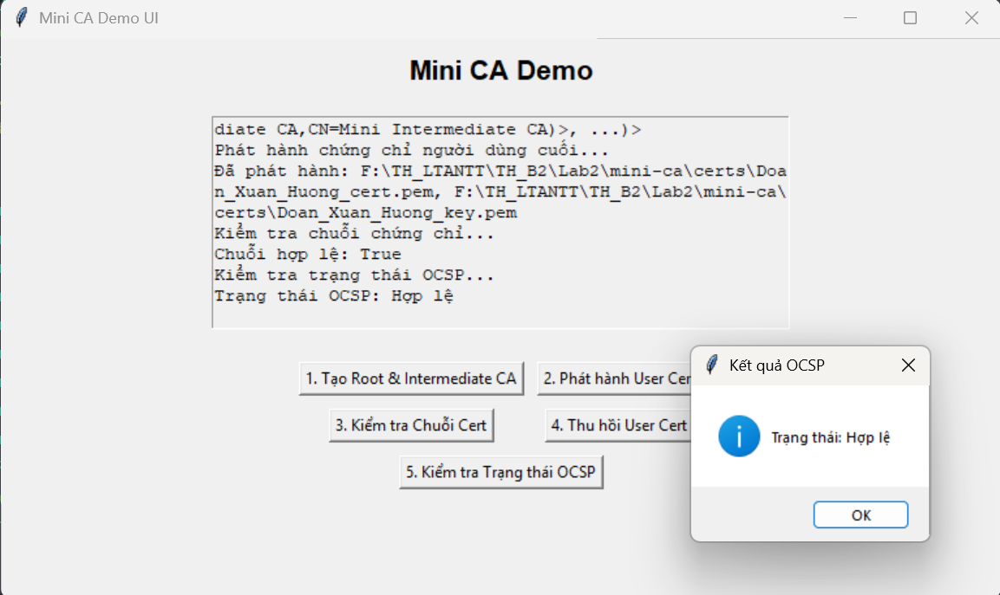
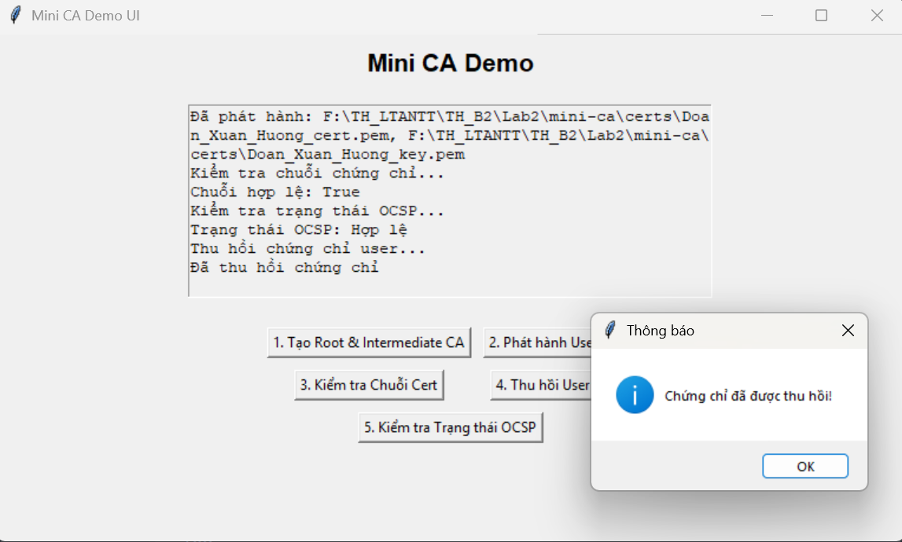
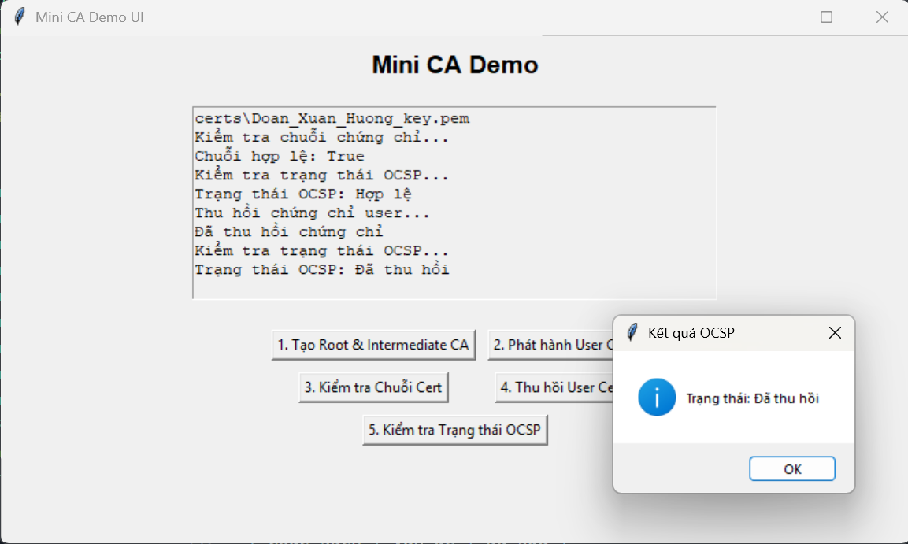

# Lab 2 – Certificate Authority (Mini CA)

Thực hành: Xây dựng hệ thống CA đơn giản với chứng chỉ X.509 (mục 2.4)

Họ và tên: Đoàn Xuân Hướng

Lớp: 23DATA1

MSSV: 2387700025

---

## 1. Mục tiêu

Mô phỏng một PKI 3 cấp bằng thư viện `cryptography`:

```
Root CA  (tự ký, 10 năm, CA, path_length=1)
  └── Intermediate CA  (Root ký, 5 năm, CA, path_length=0)
        └── End-entity "Doan_Xuan_Huong"  (Intermediate ký, 1 năm, không phải CA)
```

| Yêu cầu (2.4.1) | Hàm trong code |
|---|---|
| `create_root_ca()` – tạo chứng chỉ Root CA | `ca_utils.create_root_ca()` |
| `create_intermediate_ca(root_ca)` – tạo CA trung gian | `ca_utils.create_intermediate_ca(root_key, root_cert)` |
| `issue_certificate(ca, subject_info)` – phát hành chứng chỉ end-entity | `ca_utils.issue_certificate(ca_key, ca_cert, subject_info)` |
| `verify_certificate_chain(cert, ca_chain)` – xác thực chuỗi | `ca_utils.verify_certificate_chain(cert, [intermediate, root])` |
| `revoke_certificate(cert_serial, reason)` – thu hồi | `revoke_utils.revoke_certificate(cert_file, issuer_cert_file, issuer_key_file, reason)`: thêm serial vào CRL `certs/ca_crl.pem`, ký lại bằng khoá Intermediate |
| `check_ocsp_status(cert_serial)` – kiểm tra trạng thái | `revoke_utils.check_revocation_status(cert_file)`: tra serial trong CRL |

Tên hàm và tham số trong code theo phần hướng dẫn 2.4.2 của sách, khác một chút so với danh sách
yêu cầu 2.4.1. "OCSP" ở đây chỉ là tra CRL cục bộ, không có OCSP responder thật.

## 2. Cấu trúc

```
Lab2/
├── README.md
└── mini-ca/
    ├── ca_utils.py         sinh khoá, tạo Root/Intermediate CA, phát hành, xác thực chuỗi
    ├── revoke_utils.py     CRL: tạo, thu hồi, kiểm tra trạng thái
    ├── demo.py             chạy toàn bộ quy trình trên terminal
    ├── demo_ui.py          giao diện Tkinter 5 nút
    └── requirements.txt
```

Khi chạy sẽ sinh thêm `mini-ca/certs/`: `root_ca_key.pem`, `root_ca_cert.pem`,
`intermediate_key.pem`, `intermediate_cert.pem`, `Doan_Xuan_Huong_key.pem`, `Doan_Xuan_Huong_cert.pem`,
`ca_crl.pem`. Khoá riêng được lưu **không mã hoá**, vì vậy `certs/` và `*.pem` đã nằm trong
`.gitignore` ở gốc repo (trang 63).

## 3. Chạy demo trên terminal

```bash
cd TH_B2/Lab2/mini-ca
python -m pip install -r requirements.txt
python demo.py
```


```
Tạo Root CA...
Root CA: <...RSAPrivateKey object at 0x...>, <Certificate(subject=<Name(C=VN,O=Mini Root CA,CN=Mini Root CA Root)>, ...)>
Tạo Intermediate CA...
Intermediate CA: <...RSAPrivateKey object at 0x...>, <Certificate(subject=<Name(C=VN,O=Mini Intermediate CA,CN=Mini Intermediate CA)>, ...)>
Phát hành chứng chỉ người dùng cuối...
Đã phát hành: ...\mini-ca\certs\Doan_Xuan_Huong_cert.pem, ...\mini-ca\certs\Doan_Xuan_Huong_key.pem
Kiểm tra chuỗi chứng chỉ...
Chuỗi hợp lệ: True
Thu hồi chứng chỉ user1...
Đã thu hồi
Kiểm tra trạng thái OCSP của Doan_Xuan_Huong_cert.pem...
Trạng thái: Revoked
```

Thông tin chứng chỉ người dùng nằm trong biến `USER_INFO` ở đầu `demo.py` và `demo_ui.py`:
`common_name` = `Doan_Xuan_Huong`, `org` = `HUTECH University`, `country` = `VN`

## 4. Chạy giao diện

```bash
python demo_ui.py
```

Bấm lần lượt:

1. **Tạo Root & Intermediate CA** → "Đã tạo Root và Intermediate CA thành công!"



2. **Phát hành User Cert** → "Phát hành chứng chỉ thành công!" (bấm khi chưa tạo CA sẽ báo lỗi)



3. **Kiểm tra Chuỗi Cert** → "Chuỗi chứng chỉ hợp lệ: True"



4. **Kiểm tra Trạng thái OCSP** → "Trạng thái: Hợp lệ"



5. **Thu hồi User Cert** → "Chứng chỉ đã được thu hồi!"



6. **Kiểm tra Trạng thái OCSP** lần nữa → "Trạng thái: Đã thu hồi"




