# BÀI THỰC HÀNH 3

Họ và tên: Đoàn Xuân Hướng
Lớp: 23DATA1
MSSV: 2387700025

---

## 1. Mục tiêu

- Xây dựng ứng dụng chat bảo mật **SecureChat**: giao tiếp qua SSL/TLS với xác thực chứng chỉ hai chiều (CA tự tạo), mã hóa đầu-cuối tin nhắn bằng AES-256.
- Xây dựng bộ công cụ trinh sát mạng **Netrecon**: quét cổng, nhận dạng dịch vụ, lấy banner, vẽ sơ đồ mạng, kiểm tra lỗ hổng cơ bản — có giao diện CLI và web (Flask), tự gửi kết quả qua email.

> **Ghi chú đạo đức:** toàn bộ thao tác quét/thử nghiệm chỉ thực hiện trên máy của chính mình (`127.0.0.1`) hoặc `scanme.nmap.org` — mục tiêu thử nghiệm chính thức của dự án Nmap. Đề bài dùng IP trong lớp (`10.14.89.200`, `192.168.1.1`), trong bài làm này được thay bằng `127.0.0.1` cho hợp lệ.

## 2. Cơ sở lý thuyết

**Socket bảo mật SSL/TLS:** socket truyền thống không mã hóa, dữ liệu có thể bị nghe lén hay giả mạo. SSL/TLS mã hóa toàn bộ dữ liệu truyền đi sau khi hai bên bắt tay (handshake) trao đổi khóa bằng mã hóa bất đối xứng, sau đó dùng mã hóa đối xứng cho phiên làm việc; server xuất trình chứng chỉ số để client xác minh danh tính, chống tấn công trung gian (MITM).

**Xác minh chứng chỉ:** chứng chỉ số do CA (Certificate Authority) phát hành, chứa danh tính và khóa công khai. Quy trình xác minh gồm: kiểm tra chữ ký của CA, truy chuỗi lên Root CA tin cậy, kiểm tra hạn dùng/thu hồi, khớp thông tin đối tượng kết nối.

**Quét cổng & nhận dạng dịch vụ:** quét cổng xác định trạng thái cổng (open / closed / filtered) bằng các kỹ thuật TCP Connect, SYN, UDP, FIN/Xmas/NULL... Nhận dạng dịch vụ (service fingerprinting) phân tích banner và phản hồi giao thức để suy ra phần mềm phía sau cổng (ví dụ `nmap -sV`).

## 3. Cài đặt OpenSSL và tạo chứng chỉ số

Tải **Win64 OpenSSL v3.6.5 Light** tại trang slproweb.com, cài đặt bình thường và thêm `C:\Program Files\OpenSSL-Win64\bin` vào PATH của Windows.

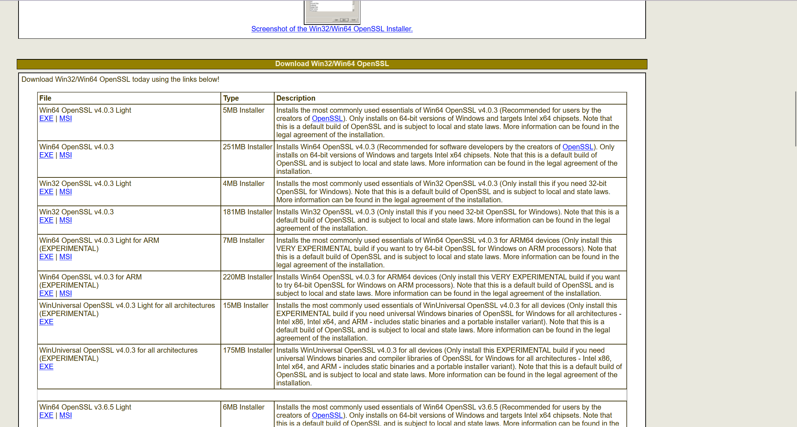
*Hình 1. Trang tải OpenSSL — chọn bản Win64 OpenSSL v3.6.5 Light (6MB Installer).*

Kiểm tra phiên bản trong terminal (cửa sổ mở sau khi thêm PATH):

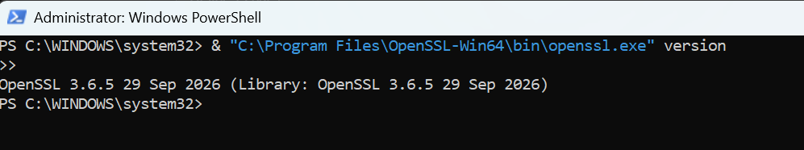
*Hình 2. Kiểm tra OpenSSL — `OpenSSL 3.6.5 29 Sep 2026`.*

Tạo thư mục `secure-chat` gồm cấu trúc 8 file nguồn + thư mục `certs`:

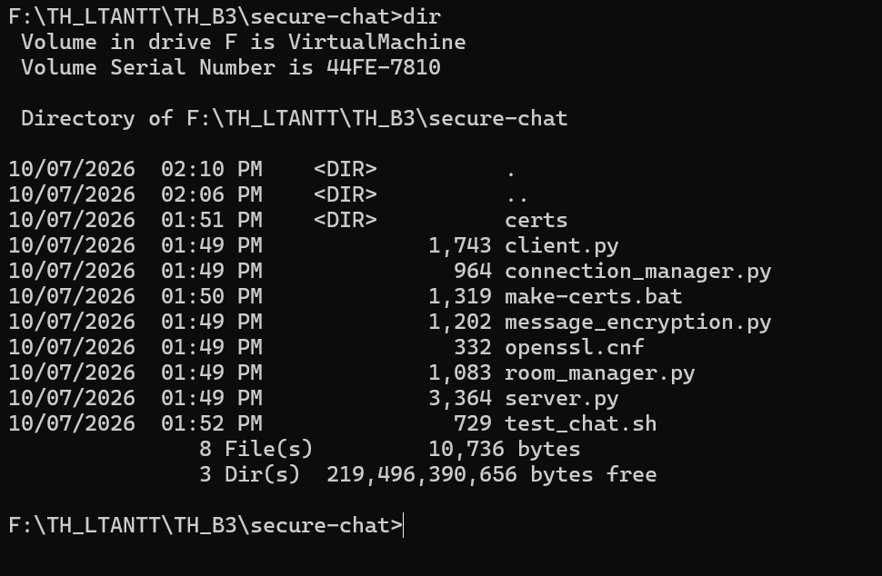
*Hình 3. Cấu trúc thư mục `secure-chat` (certs, openssl.cnf, make-certs.bat và 5 file Python).*

File `openssl.cnf` cấu hình sinh CA gốc (`CN=MyRootCA`, `basicConstraints = critical, CA:true`):

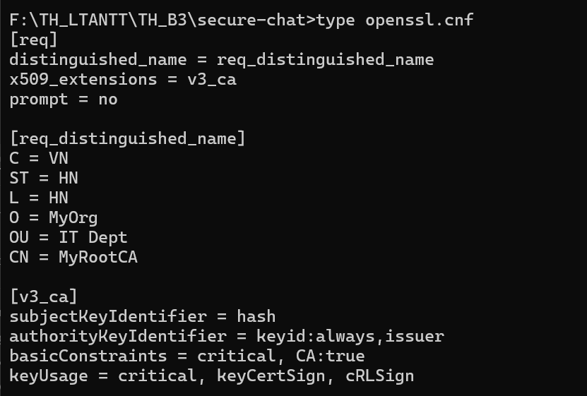
*Hình 4. Nội dung file `openssl.cnf` (section `[req]`, `[req_distinguished_name]`, `[v3_ca]`).*

Chạy `make-certs.bat` để sinh bộ chứng chỉ: CA tự ký (2048-bit RSA, SHA-256, hạn 3650 ngày), chứng chỉ server (`CN=localhost`) và chứng chỉ client (`CN=client`) đều được CA ký (hạn 365 ngày):

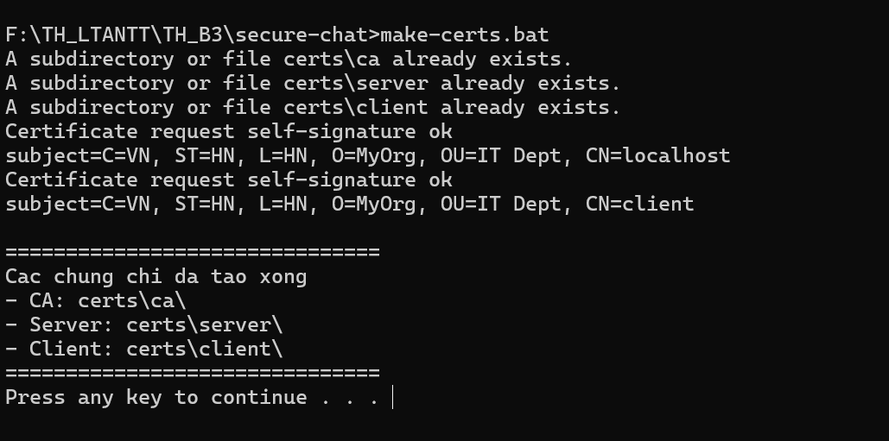
*Hình 5. Chạy `make-certs.bat` — sinh chứng chỉ thành công ("Cac chung chi da tao xong", liệt kê CA / Server / Client).*

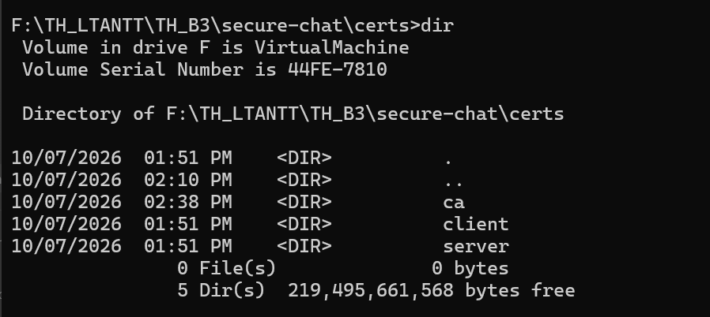
*Hình 6. Thư mục `certs` gồm 3 thư mục con `ca`, `server`, `client`.*

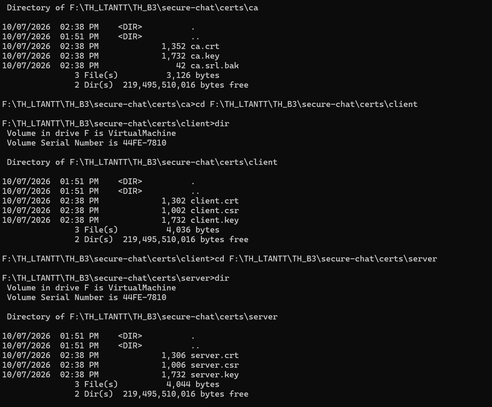
*Hình 7. Nội dung `certs\ca` (ca.crt, ca.key), `certs\server` (server.crt, server.csr, server.key), `certs\client` (client.crt, client.csr, client.key).*

## 4. Ứng dụng chat bảo mật SecureChat

SecureChat gồm 5 module Python:

| File | Vai trò |
|---|---|
| `message_encryption.py` | mã hóa đầu-cuối AES-256-CBC + PKCS7, IV ngẫu nhiên mỗi tin |
| `connection_manager.py` | quản lý danh sách client (socket → username, khóa AES), an toàn đa luồng |
| `room_manager.py` | quản lý phòng chat, broadcast theo phòng |
| `server.py` | server SSL/TLS đa luồng cổng 8443, `CERT_REQUIRED` — yêu cầu client có chứng chỉ do CA ký |
| `client.py` | xác minh chứng chỉ server bằng CA, gửi `username:khóa_AES` khi kết nối, thread nhận/giải mã tin |

Chạy server trước:

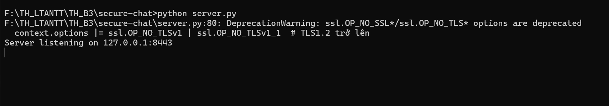
*Hình 8. Server khởi động — `Server listening on 127.0.0.1:8443` (dòng DeprecationWarning là cảnh báo của Python về cờ `OP_NO_TLSv1`, không ảnh hưởng vận hành — vẫn ép TLS 1.2 trở lên).*

Chạy client thứ nhất, đăng nhập và gửi tin:

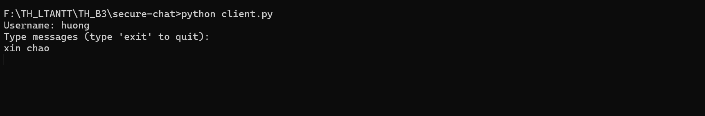
*Hình 9. Client 1 (`huong`) — prompt `Username:`, dòng `Type messages (type 'exit' to quit):` và tin `xin chao`.*

Chạy client thứ hai trong cửa sổ khác:

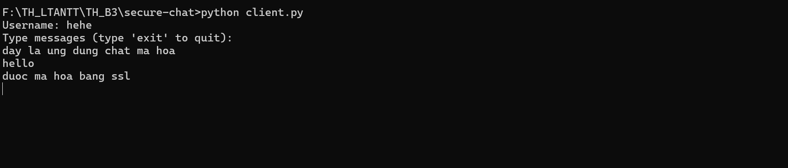
*Hình 10. Client 2 (`hehe`) — gửi `day la ung dung chat ma hoa`, `hello`, `duoc ma hoa bang ssl`.*

Client 1 nhận được tin của client 2 (giải mã thành công):

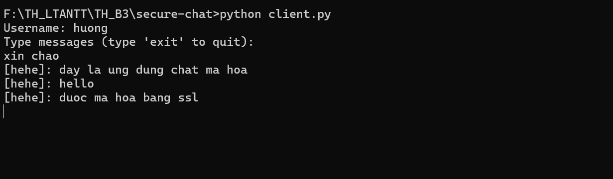
*Hình 11. Client 1 nhận tin từ client 2: `[hehe]: day la ung dung chat ma hoa`, `[hehe]: hello`, `[hehe]: duoc ma hoa bang ssl`.*

Log phía server cho thấy cả hai client kết nối và tin được chuyển tiếp:

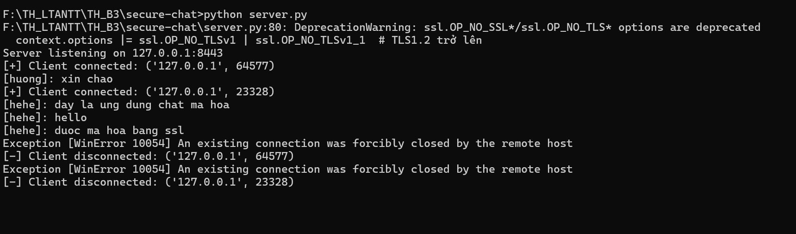
*Hình 12. Log server — `[huong]: xin chao`, `[hehe]: duoc ma hoa bang ssl`; ngoại lệ `[WinError 10054]` phát sinh khi client đóng kết nối (`exit`) — vô hại.*

**Nhận xét:** tin nhắn hiển thị dạng `[username]: nội dung` ở phía người nhận chứng tỏ tin đã được mã hóa khi truyền (qua kênh TLS) và được giải mã đầu-cuối bằng khóa AES-256 riêng của từng client.

## 5. Chuẩn bị công cụ cho Netrecon

Cài Nmap (công cụ nhận dạng dịch vụ — `service_detector.py` gọi lệnh `nmap -sV`):

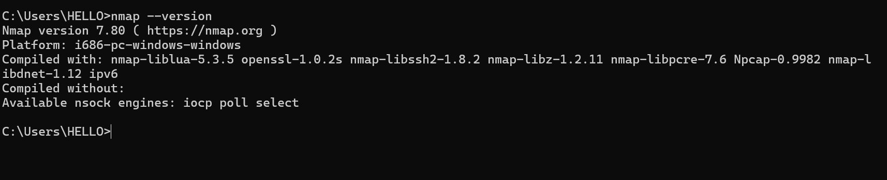
*Hình 13. Kiểm tra Nmap — `Nmap version 7.80` (bản trên máy, ảnh minh họa của đề là 7.97).*

Tạo **mật khẩu ứng dụng** Gmail (cần bật xác thực 2 bước trước) để Netrecon gửi email kết quả:

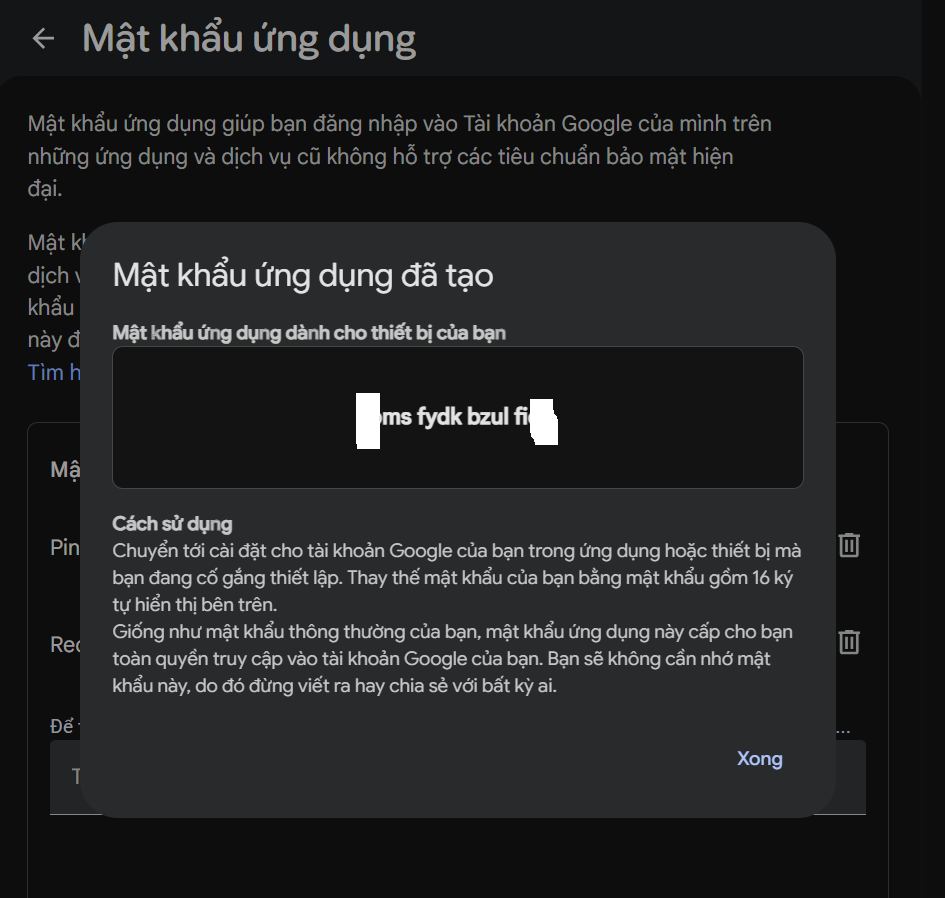
*Hình 14. Hộp thoại "Mật khẩu ứng dụng đã tạo" của Google Account — mã mật khẩu được che bớt khi chụp, chỉ dùng để điền vào file `.env`.*

## 6. Bộ công cụ trinh sát mạng Netrecon

Thư mục `netrecon` gồm: package `modules\` (7 module), giao diện web `templates\` + `static\`, `cli.py`, `app.py`, `requirements.txt`, `.env` (biến `SMTP_USER` / `SMTP_PASS` — mật khẩu ứng dụng, không commit lên Git).

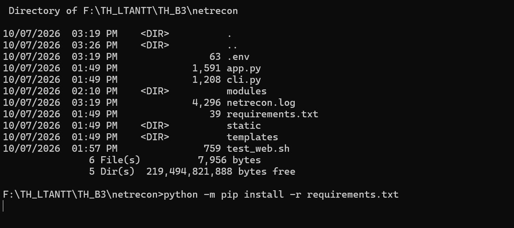
*Hình 15. Cấu trúc thư mục `netrecon` và cài thư viện: `python -m pip install -r requirements.txt`.*

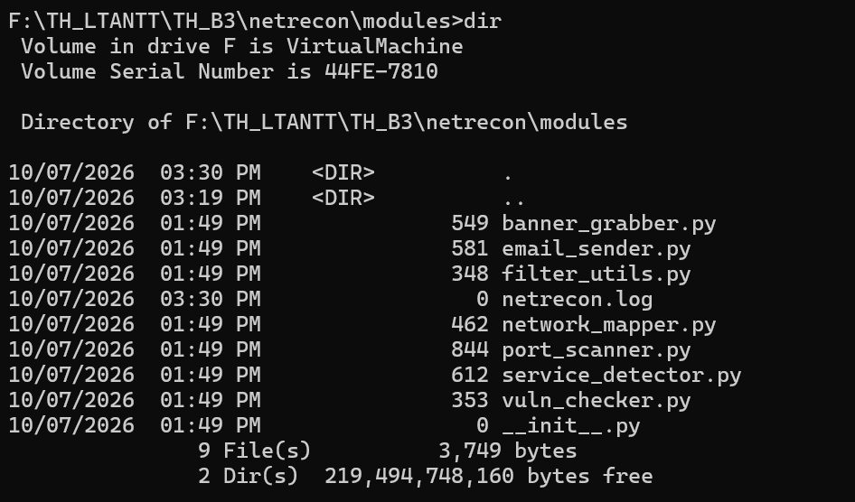
*Hình 16. Các module: `banner_grabber.py`, `email_sender.py`, `filter_utils.py`, `network_mapper.py`, `port_scanner.py`, `service_detector.py`, `vuln_checker.py`, `__init__.py`.*

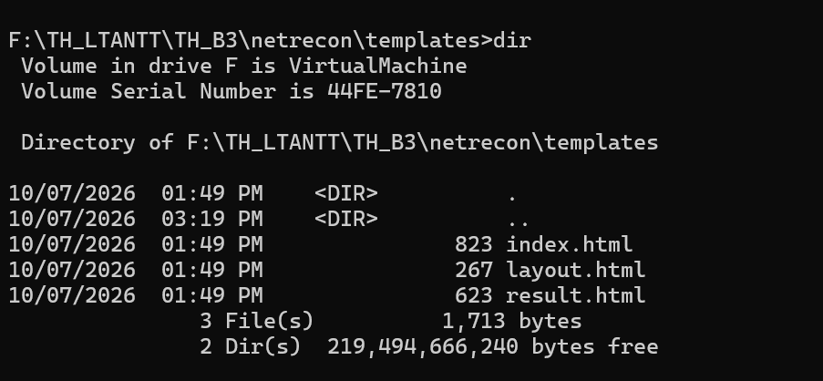
*Hình 17. Các template giao diện web: `index.html`, `layout.html`, `result.html`.*

Chức năng từng module:

- `port_scanner.py` — quét cổng TCP bằng asyncio, giới hạn tốc độ bằng `asyncio.Semaphore` (rate limiting).
- `service_detector.py` — nhận dạng phiên bản dịch vụ qua `nmap -sV`.
- `banner_grabber.py` — lấy banner qua socket, có timeout.
- `network_mapper.py` — liệt kê interface + bảng ARP (sơ đồ mạng).
- `vuln_checker.py` — tra cứu CVE cơ bản theo cổng (21/22/23/80/443).
- `filter_utils.py` — lọc target theo whitelist / blacklist.
- `email_sender.py` — gửi kết quả qua Gmail SMTP (SMTP_SSL cổng 465).

Mọi hoạt động được ghi log kèm timestamp vào `netrecon.log`.

## 7. Kiểm thử

**7.1. Quét từ CLI** (`cli.py --target <IP> --ports <DS cổng> --mode scan|service|banner|map|vuln|all`):

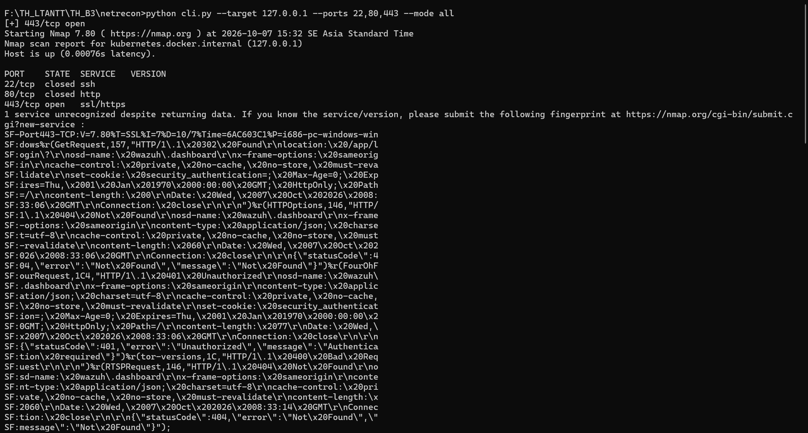
*Hình 18. `python cli.py --target 127.0.0.1 --ports 22,80,443 --mode all` — kết quả `nmap -sV`: `22/tcp closed ssh`, `80/tcp closed http`, `443/tcp open ssl/https` (dịch vụ `wazuh.dashboard` — máy có sẵn dịch vụ trên cổng 443).*

**7.2. Giao diện web** — chạy `python app.py` rồi mở `http://localhost:5000/`, nhập thông số và nhấn **Scan**:

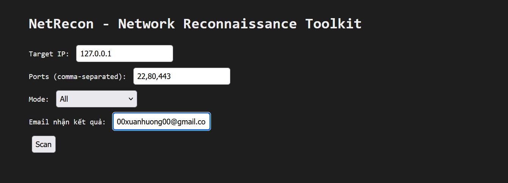
*Hình 19. Giao diện "NetRecon - Network Reconnaissance Toolkit": Target IP `127.0.0.1`, Ports `22,80,443`, Mode `All`, Email nhận kết quả, nút Scan.*

**7.3. Nhận kết quả qua email** — hệ thống gửi email tiêu đề *"Kết quả quét từ NetRecon"* gồm các mục `SCAN` / `SERVICE` / `BANNER` / `MAP`:

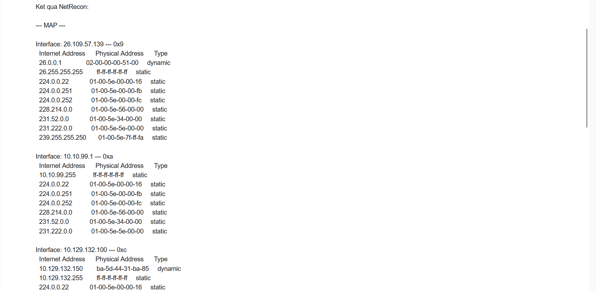
*Hình 20. Nội dung kết quả gửi qua email — mục `--- MAP ---`: sơ đồ mạng liệt kê interface (`26.109.57.139`, `10.10.99.1`, `10.129.132.100`) kèm bảng ARP (Internet Address / Physical Address / Type).*

## 8. Kết luận

- SecureChat hoạt động đúng yêu cầu: kênh truyền SSL/TLS có xác thực chứng chỉ hai chiều, tin nhắn được mã hóa đầu-cuối AES-256 theo khóa riêng từng client, hỗ trợ nhiều client và phòng chat.
- Netrecon đáp ứng yêu cầu đề bài: quét cổng (có rate limiting), nhận dạng dịch vụ, banner grabbing, sơ đồ mạng, kiểm tra lỗ hổng cơ bản, whitelist/blacklist, ghi log timestamp, có CLI + web UI và gửi email kết quả.
- Ghi chú môi trường: quét trên `127.0.0.1` thay cho IP của đề; Nmap trên máy là 7.80; `requirements.txt` của đề liệt kê thêm `asyncio` (đã có trong thư viện chuẩn Python) và `htmx` (thư viện JavaScript, gói Python cùng tên không được dùng) — 2 gói thừa, không ảnh hưởng chương trình. Mục `SCAN` trong email/web hiện `None` là do `async_scan_ports` không trả giá trị (đặc điểm code của đề) — kết quả quét cổng được in ra console.

